# Render Visuals Skill

[](https://github.com/imshaikot/render-visual-skill/actions/workflows/validate.yml)
[](LICENSE)
[](https://agentskills.io)

**Your coding agent cannot draw.** This [Agent Skill](https://agentskills.io) fixes that —
diagrams, presentation slides, social cards, code snippets and device mockups, authored as
HTML/SVG and rendered to crisp PNGs by the headless Chromium you already have. Hand it mermaid
and it lays the flowchart out for itself. No design tool, no API, no npm dependencies.

| | | |
| --- | --- | --- |
|  |  |  |
| diagram · `ember` | slide · `slate` | card · `paper` |

Sequence diagrams animate — each step tweened over several frames, assembled into a looping
GIF **in pure Node**. Chrome renders the frames in parallel, the built-in zlib decodes them,
and a hand-rolled GIF89a/LZW encoder with changed-region deltas does the rest:


```sh
claude plugin marketplace add imshaikot/render-visual-skill
claude plugin install render-visual-skill@render-visual-skill
```

Works in any skills-compatible agent — Claude Code, Cursor, GitHub Copilot / VS Code, Codex,
Gemini CLI, OpenCode, Amp and Goose. [Install](#install) covers the clone-a-branch lane that
every agent other than Claude Code uses.

Every image in this README was rendered by the skill.

## Contents

- [Gallery](#gallery)
- [Capabilities](#capabilities)
- [Requirements](#requirements)
- [Install](#install)
- [Usage](#usage)
- [Themes](#themes)
- [Element library](#element-library)
- [CLI reference](#cli-reference)
- [What's inside](#whats-inside)
- [Why HTML instead of a design tool](#why-html-instead-of-a-design-tool)
- [Uninstall](#uninstall)
- [License](#license)

## Gallery

Five more diagram idioms ship as templates, each 1360×740 and assembled from the same parts:

| | | |
| --- | --- | --- |
| 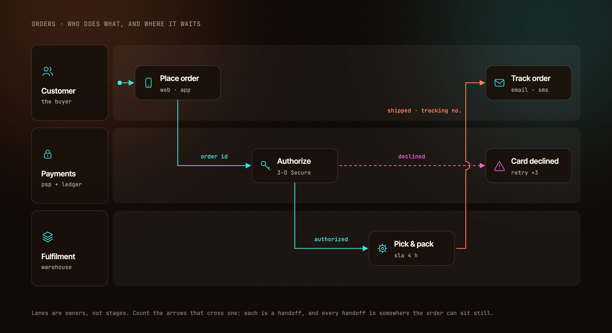 | 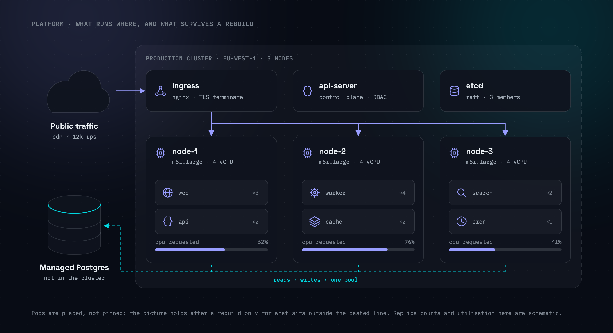 | 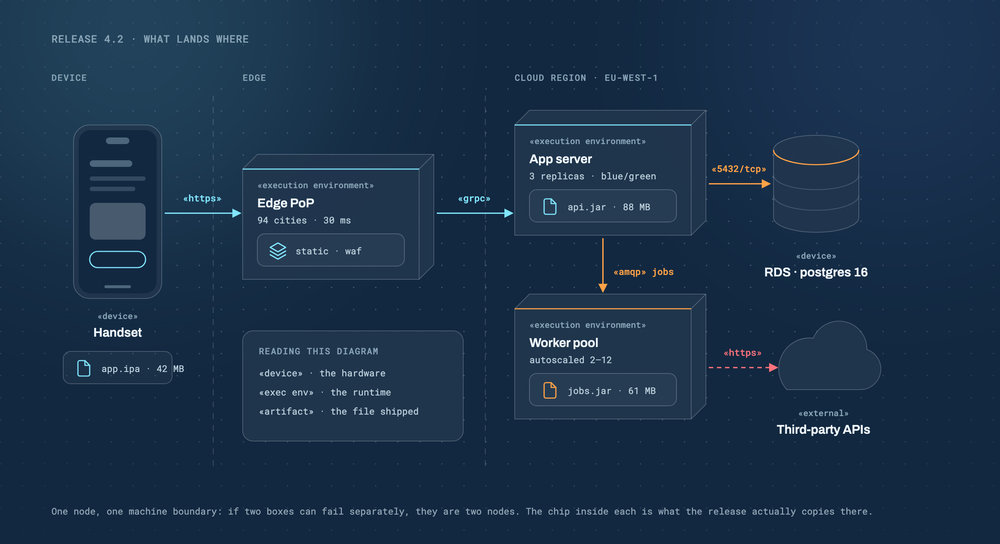 |
| swimlane · `ember` | cluster · `slate` | deployment · `blueprint` |
| 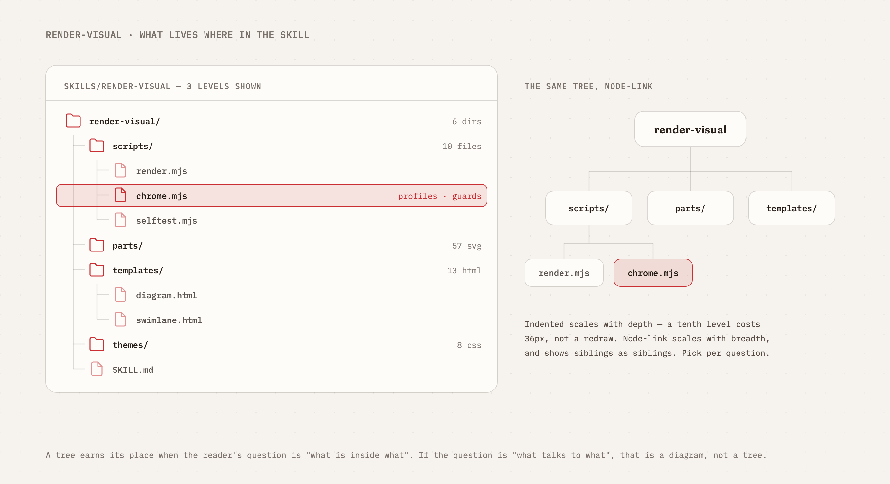 | 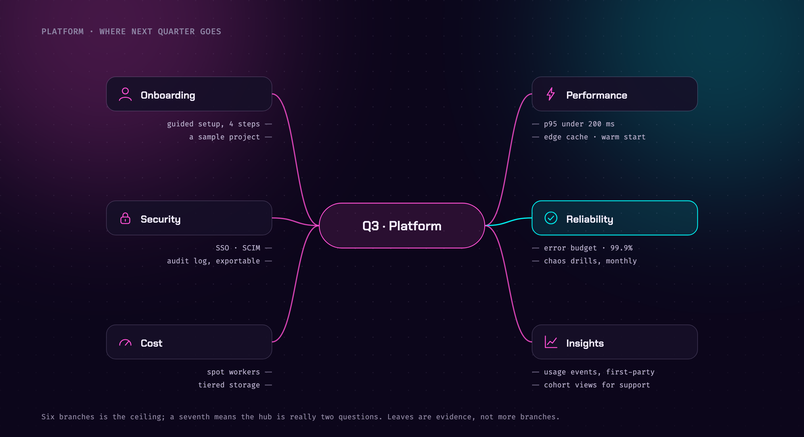 | |
| tree · `paper` | mind map · `neon` | |

Same markup, different theme:


Code snippets get a Carbon-style window — hand-highlighted with a fixed token→accent mapping,
line numbers, a highlight line and diff rows, in any of the eight themes:

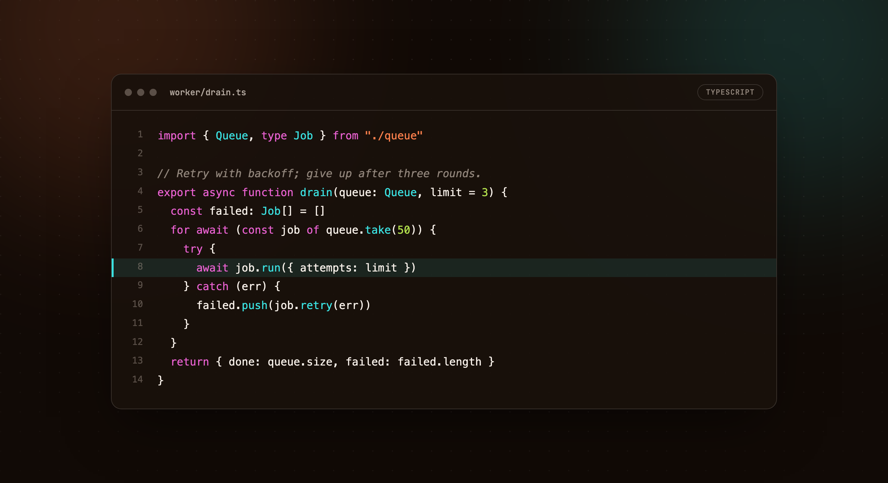

**Mermaid needs no drawing at all.** Paste a flowchart and a deterministic layout engine
turns it into a figure — ranks, one lane per elbow, bridged crossings, subgraph boundaries
and return paths, on a canvas sized to whatever it needed. The image below is fourteen lines
of mermaid and one command:

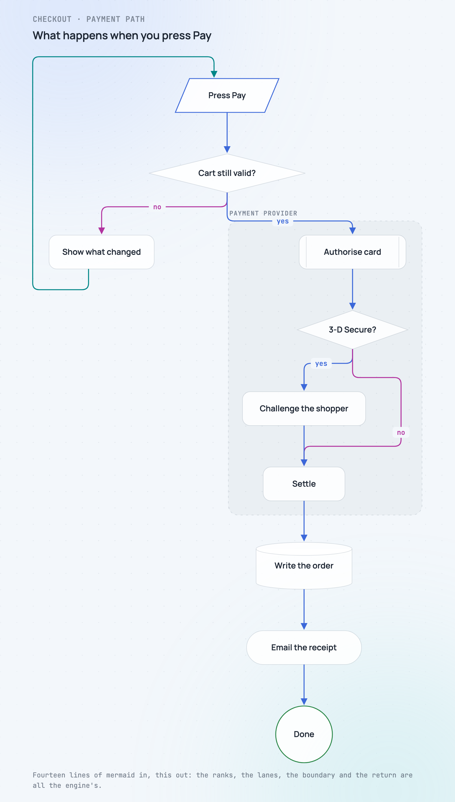

## Capabilities

| | |
| --- | --- |
| **Diagrams** | Architecture and flow figures — nodes, labelled arrows, return paths, bridged line crossings. 1360×740 |
| **Mermaid flowcharts** | Paste `flowchart TD` and a deterministic engine lays it out — every shape and link kind, subgraphs, decisions, retry loops. Syntax it does not implement is refused, never silently dropped |
| **Presentation slides** | Kicker, gradient headline, up to three points, footer. 1920×1080; a deck is one file per slide |
| **Social / og cards** | Mark, headline, one-paragraph pitch, chips. 1200×630 |
| **Code snippets** | Carbon-style window, hand-highlighted against a fixed token→accent mapping, line numbers, a highlight line, diff rows |
| **Sequence diagrams** | Lifelines, calls, returns, activations — rendered static, or animated step by step |
| **Swimlanes** | Lanes that own the steps, labelled handoffs, an exception path that stays in its lane |
| **Trees** | One hierarchy two ways — an indented tree view beside the same tree drawn node-link |
| **Clusters** | A dashed boundary, control plane, worker nodes and pods; what is outside it survives a rebuild |
| **Deployment diagrams** | 3-D nodes, «stereotypes» and artifact chips: which file lands on which machine, over which protocol |
| **Mind maps** | A question in the middle, branches around it, leaves as evidence |
| **Animated GIFs** | Steps tweened over several frames (`slide`, `fade`, `pop`), assembled in pure Node. No ffmpeg |
| **Element library** | 57 referenceable parts — device frames, infrastructure shapes, a 3-D deployment node, charts, BI furniture and 30 glyphs |
| **Chart & BI schematics** | Pie, donut, bar, hbar, line, area, stacked, scatter, funnel, gauge, heatmap, sparkline, dashboard, KPI tile, table |
| **Your own images** | Screenshots and photos placed into a device frame or cropped to a shape, inlined before the render |
| **Eight themes** | Swap with one flag — every template consumes design tokens, never hard-coded colour |
| **Alpha grades** | Every colour token has a component twin, so `oklch(var(--a1-raw) / 12%)` gives any transparency of any accent — washes, edges and scrims that cannot drift from the colour they came from |
| **Transparent output** | A real alpha channel via `--transparent`, so a figure drops onto any background |
| **Parallel-safe** | Each render claims its own Chrome profile by pid lockfile, and reaps orphans an interrupted run left behind |
| **Fails loudly** | A wrong image at exit 0 is the one thing refused outright — blank canvases, missing stylesheets, unreadable images and unknown parts all fail, never render quietly wrong |

## Requirements

- **Node 18+**
- **A Chromium-based browser** — Chrome, Chromium, Brave or Edge. Standard install paths and
  `PATH` are probed; `CHROME_PATH` overrides. Without one:
  `npx @puppeteer/browsers install chrome@stable` (no root needed).
- **Network access at render time**, for theme fonts. All eight themes `@import` from
  `fonts.googleapis.com`. Offline renders still succeed but fall back to system fonts, so
  they will not match the previews above.

It needs a shell and a local browser, so it cannot run on surfaces that have neither —
claude.ai chat, the Skills API, cloud sessions and most CI images.

## Install

**Claude Code — as a plugin** (gets you `/plugin update`). From your shell:

```sh
claude plugin marketplace add imshaikot/render-visual-skill
claude plugin install render-visual-skill@render-visual-skill
```

Or from inside Claude Code, as **two separate commands** — run the first, let it finish, then
run the second:

```
/plugin marketplace add imshaikot/render-visual-skill
```

```
/plugin install render-visual-skill@render-visual-skill
```

> [!IMPORTANT]
> `/plugin marketplace add` may open an **Add Marketplace** dialog. Only
> `imshaikot/render-visual-skill` belongs in that field. Pasting both lines into it is
> rejected as an invalid `owner/repo` shorthand — the `/plugin install` line is a second
> command, not part of the source.

The repeated name is not a typo: `render-visual-skill@render-visual-skill` reads as
`plugin@marketplace`, and here both are called the same thing.

**Any agent — clone the skill into its skills directory.** The `skill` branch is published by
CI with the skill at its root, so the clone target *is* the skill:

```sh
# Cursor · VS Code/Copilot · Codex · Gemini CLI · OpenCode · Amp · Goose
git clone --depth 1 -b skill https://github.com/imshaikot/render-visual-skill.git \
  ~/.agents/skills/render-visual

# Claude Code
git clone --depth 1 -b skill https://github.com/imshaikot/render-visual-skill.git \
  ~/.claude/skills/render-visual
```

Update with `git -C <that directory> pull --ff-only`.

> [!NOTE]
> Cursor, VS Code, OpenCode, Amp and Goose read **both** `~/.agents/skills` and
> `~/.claude/skills`. Installing into both shows a duplicate entry in those five — pick one,
> or use the plugin lane for Claude Code and `~/.agents/skills` for everything else.

## Usage

Just ask for a visual:

- *"make a diagram of our auth flow"*
- *"turn these notes into a 6-slide deck, paper theme"*
- *"an og card for this repo"*
- *"put this screenshot in a browser frame"*
- *"render this mermaid flowchart"* — pasted, or a `.mmd` file

Or drive the renderer by hand:

```sh
S=~/.agents/skills/render-visual
node $S/scripts/render.mjs  $S/templates/diagram.html  figure.png   --theme slate
node $S/scripts/render.mjs  $S/templates/code.html     snippet.png  --theme paper --transparent
node $S/scripts/animate.mjs $S/templates/sequence.html sequence.gif --theme ember

node $S/scripts/mermaid.mjs  flow.mmd  flow.html  --theme frost   # mermaid -> a themed page
node $S/scripts/render.mjs   flow.html flow.png   --theme frost   # ...then the usual shot
```

The canvas size comes from the template's `<body>`; `--scale` defaults to 2 (retina).
`--theme` inlines the theme, so no `themes/` directory has to sit beside your figure.

When a request names no theme, the agent asks rather than guesses — and remembers the
answer. Standing choices (theme, where finished images land, scale) live in a
`.render-visual.json` at your project root, written only with your consent, so the next
render doesn't re-open settled questions:

```json
{ "theme": "slate", "output": "docs/figures/", "scale": 2 }
```

Anything said in the prompt beats the file; delete it to change course. The renderer
itself never reads it — `--theme` stays explicit on every command.

## Themes

Every template consumes tokens only, so one source file renders in any theme.

| Theme | Mood | Fonts |
| --- | --- | --- |
| `ember` | Warm dark — amber-hued neutrals, cyan/ember/magenta accents | Inter Tight + JetBrains Mono |
| `slate` | Cool dark — violet-leaning neutrals, jewel accents | Space Grotesk + IBM Plex Mono |
| `paper` | Light editorial — warm paper, serif display, print restraint | Fraunces + IBM Plex Mono |
| `terminal` | Near-black phosphor — mono everything, green/amber | JetBrains Mono |
| `blueprint` | Drafting board — cyanotype navy, chalk lines, a grid that reads | Archivo + Roboto Mono |
| `frost` | Light UI — cool white, glass surfaces, indigo/teal | Manrope + JetBrains Mono |
| `neon` | After hours — indigo dark, high-chroma magenta and cyan | Chakra Petch + Fira Code |
| `sepia` | Aged press — cream stock, brown ink, typewriter mono | Newsreader + Courier Prime |

`templates/palette.html` is a specimen sheet that renders in whichever theme you hand it and
labels itself from the tokens it was given — both fonts, the gradient, the neutrals, the
alpha ladders, and the same parts dressed by that theme:

```sh
node $S/scripts/render.mjs $S/templates/palette.html palette.png --theme neon
```

| | |
| --- | --- |
| 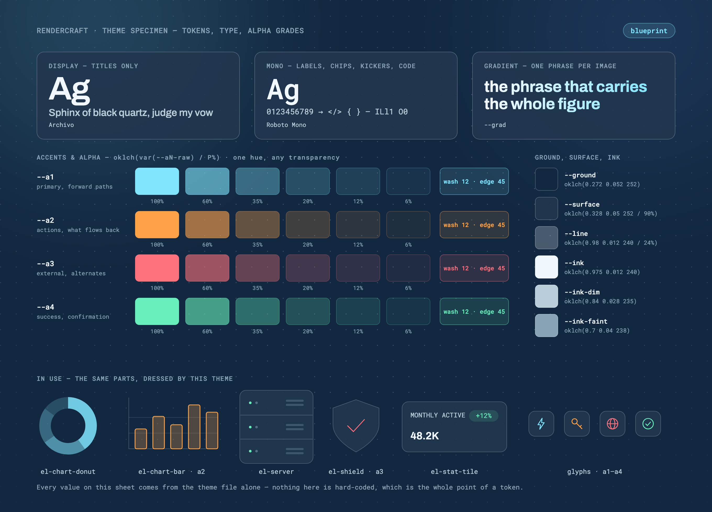 | 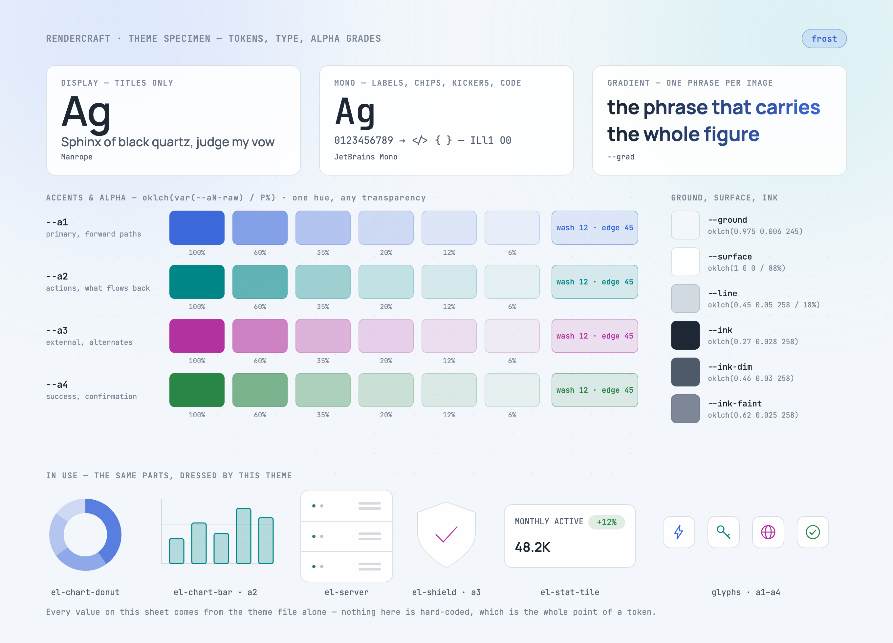 |
| `blueprint` | `frost` |
| 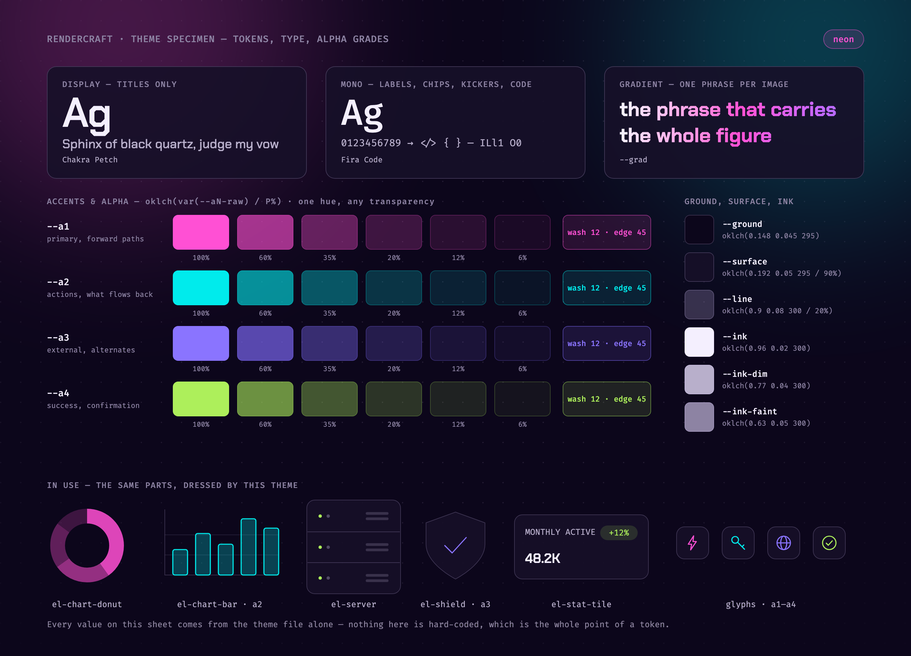 | 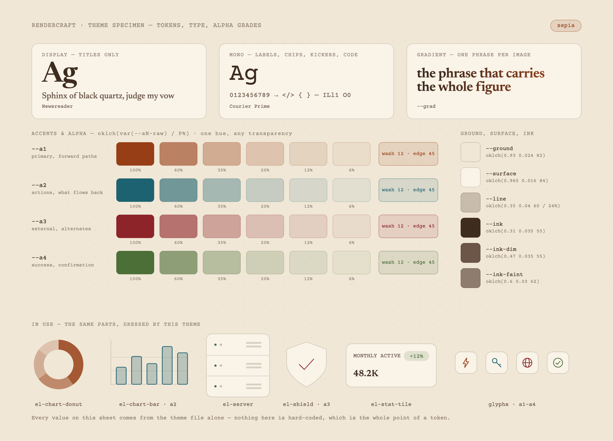 |
| `neon` | `sepia` |

### Alpha grades

Every colour token ships a component twin — `--a1-raw`…`--a4-raw`, `--ink-raw`,
`--ground-raw`, `--surface-raw` — three bare OKLCH numbers, so any transparency of any token
is one expression away:

```css
.badge { background: oklch(var(--a1-raw) / 12%); border: 1px solid oklch(var(--a1-raw) / 45%); color: var(--a1); }
.scrim { background: oklch(var(--ground-raw) / 72%); }   /* a caption band over a photo */
```

The solid token is built from the same components (`--a1: oklch(var(--a1-raw))`), so a wash
can never drift from the colour it is a wash of — and an invariant refuses any theme whose
component tokens are not composable, because a bad one paints *nothing* rather than failing.

Adding a theme is one CSS file defining the same tokens. Adding a template is one HTML file
that consumes only tokens.

## Element library

Figures assemble from **57 parts** — window/browser/terminal/phone frames, database, server,
queue, cloud, router, actor, shield, a 3-D deployment cube, a 30-glyph icon set, and the chart vocabulary below. A
figure *references* a part rather than carrying a copy of its geometry:

```html
<g data-part="el-database" data-accent="2" transform="translate(70,452)"/>
```

Every part is built from theme tokens, so it restyles with the theme like everything else:


### Charts and BI

The standard chart vocabulary — pie, donut, bar, line, area, stacked, scatter, funnel, gauge,
heatmap, sparkline — plus BI furniture: a dashboard window, KPI tiles and a data table. Each
spends a single accent, graded by opacity where categories must read apart, so a chart sits in
a figure without competing with the arrows around it.

These are **schematics of charts, not charts**: every proportion in them is fixed and
arbitrary, so they can say *"a dashboard goes here"* without pretending to be data. Plot real
numbers with a real charting library.

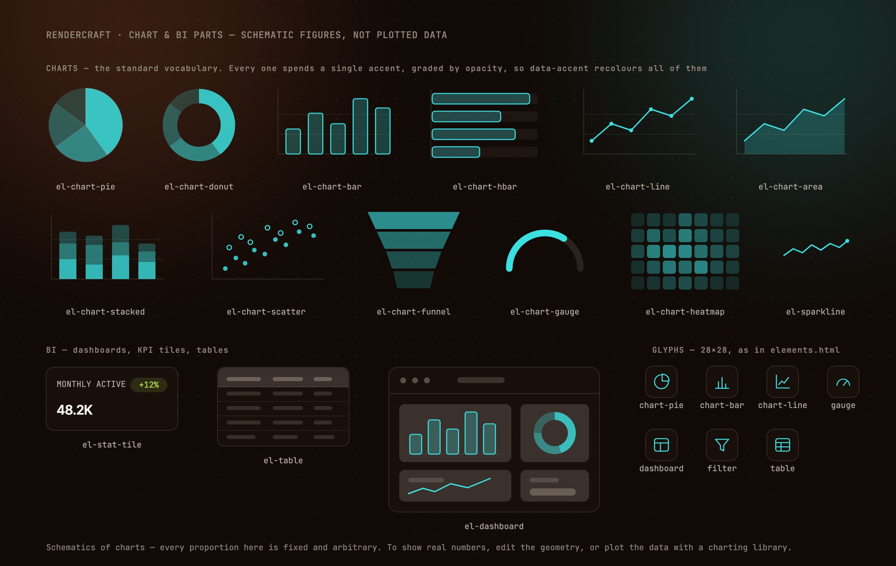

### Your own images

Point `data-image` at a screenshot or a photo on disk and it lands in a device frame — cropped
to the shell's own corners, skeleton bars covered — or in any shape you ask for:

```html
<g data-part="el-browser" data-image="./shot.png" data-align="top"/>
<image data-image="./avatar.jpg" data-shape="circle" x="60" y="420" width="160" height="160"/>
```

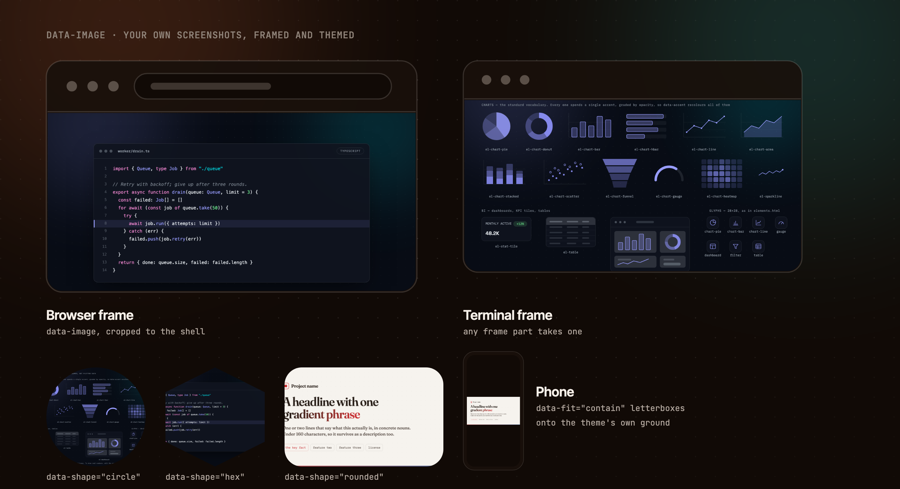

The bytes are read, format-checked and inlined before Chrome launches, so nothing is left for
the browser to fetch and quietly fail at: a missing file, a `.png` that is really a text file,
a HEIC, or a remote URL is a fatal error naming the path — never an invisible hole in a figure
that still screenshots as a success.

## CLI reference

### `render.mjs` — one PNG

```sh
node $S/scripts/render.mjs <input.html> <output.png> [flags]
```

| Flag | Default | |
| --- | --- | --- |
| `--theme` | the page's own | `ember` · `slate` · `paper` · `terminal` · `blueprint` · `frost` · `neon` · `sepia`; inlined into a temp copy |
| `--scale` | `2` | Output multiplier — 1360×740 at 2× is a 2720×1480 PNG |
| `--size` | the `<body>` | `WxH` override, e.g. `1200x630` |
| `--transparent` | off | Real alpha channel: ground and furniture stripped |

### `mermaid.mjs` — mermaid flowchart text → a themed page

```sh
node $S/scripts/mermaid.mjs <input.mmd|-> <output.html> [flags]
```

Generates; it does not render. The page it writes is ordinary themed SVG, so a label can be
reworded before `render.mjs` takes the shot, and the same file re-renders in any theme. `-`
reads the source from stdin.

| Flag | Default | |
| --- | --- | --- |
| `--theme` | `ember` | Which theme the generated page links; `render.mjs --theme` still overrides at shot time |
| `--direction` | the source's | `TD` · `TB` · `BT` · `LR` · `RL` |
| `--title` `--kicker` `--note` | none | Header and footnote, all sized into the canvas |
| `--template` | `templates/flowchart.html` | A different shell; needs the `FLOW:BEGIN`/`FLOW:END` markers |

Supported: every bracket shape, `-->` `---` `-.->` `==>` `--o` `--x` `<-->` with either label
form, chains, `A & B --> C`, `subgraph`, `classDef`/`class`/`:::`, `%%` comments and `---`
front matter. Anything else — `style`, `linkStyle`, `click`, nested subgraphs, another
diagram kind — is fatal with the line quoted, because a statement silently dropped is a step
missing from the flowchart in a PNG that renders perfectly.

### `animate.mjs` — a looping GIF

```sh
node $S/scripts/animate.mjs <input.html> <output.gif> [flags]
```

| Flag | Default | |
| --- | --- | --- |
| `--fx` | `slide` | Reveal preset: `slide`, `fade`, `pop` |
| `--fps` | `25` | Tween frame rate; 20/25/50 play back exactly |
| `--transition` | `450` | Milliseconds of tween per step |
| `--delay` | `900` | Milliseconds of dwell on each completed step |
| `--hold` | `2600` | Milliseconds on the final frame before looping |
| `--jobs` | `4` | Parallel Chrome instances |
| `--scale` | `1` | GIFs get heavy fast — stay at 1× |
| `--keep-frames` | off | Keep the per-frame PNGs for inspection |

`--theme` and `--size` work as in `render.mjs`.

### Maintenance

Renders are safe to run in parallel — each claims its own Chrome profile via a pid lockfile,
and every run first reaps Chromes an interrupted run left holding a slot. Two scripts back
that up:

```sh
node $S/scripts/doctor.mjs --prune   # reap orphans, clear stale locks, reclaim profile disk
node $S/scripts/selftest.mjs         # ~2m: assert all 29 concurrency and output invariants
```

Reach for `doctor.mjs` when a render fails with *"is another instance using profile"*.

## What's inside

```
skills/render-visual/       the skill — this directory is what gets installed
  SKILL.md                  workflow, aesthetic rules, layout discipline
  templates/                diagram · swimlane · tree · cluster · deployment ·
                            mindmap · sequence (animatable) · code — all 1360×740
                            slide 1920×1080 · card 1200×630 · flowchart (generated,
                            canvas computed) · elements + charts (parts sheets) ·
                            palette (theme specimen)
  parts/                    57 includable elements — frames, shapes, charts,
                            BI furniture, glyphs
  themes/                   ember · slate · paper · terminal · blueprint · frost
                            neon · sepia  (design tokens, swappable)
  scripts/                  render.mjs (PNG/JPEG/PDF) · animate.mjs (GIF) · gif.mjs (GIF89a)
                            mermaid.mjs (mermaid parser + layout engine)
                            chrome.mjs (profiles, reaping, guards) · cli.mjs · doctor.mjs
                            parts.mjs (element includes) · images.mjs (image includes)
                            markup.mjs · selftest.mjs
.claude-plugin/             Claude Code plugin + marketplace manifests
previews/                   the images above
```

## Why HTML instead of a design tool

- **Versioned and diffable** — a figure is a text file; regenerating after a copy change is one command
- **Consistent by construction** — templates consume theme tokens, so nothing is hand-picked per image
- **Agent-friendly** — an agent writes HTML far better than it steers a canvas

## Uninstall

The skill keeps warm Chrome profiles in your temp directory, so clean those up **before**
removing it:

```sh
node <skill directory>/scripts/doctor.mjs --prune   # reclaim profile disk, clear locks
rm -rf <skill directory>                            # e.g. ~/.agents/skills/render-visual
```

For the plugin lane, `/plugin uninstall render-visual-skill` leaves its cache behind:

```sh
rm -rf ~/.claude/plugins/cache/render-visual-skill \
       ~/.claude/plugins/marketplaces/render-visual-skill
```

Nothing else is left: all temp state lives under `$TMPDIR/render-visual/`, and renders never
write into the directory they render from.

## License

[MIT](LICENSE)
