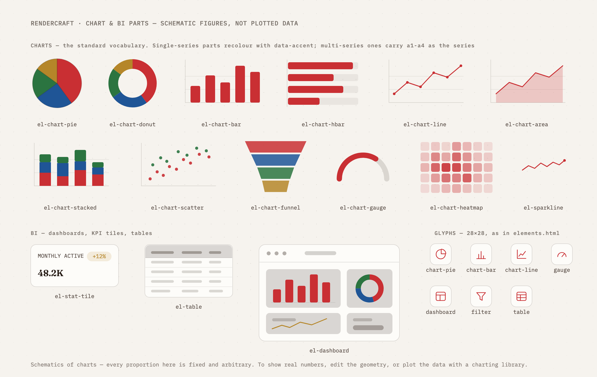

# render-visual

An [Agent Skill](https://agentskills.io) that turns a coding agent into a competent visual
designer for **diagrams, presentation slides, social cards and code snippets** — authored as
HTML/SVG, rendered to crisp PNGs by the headless Chromium you already have. No design tool,
no API, no npm dependencies.

Works in any skills-compatible agent: Claude Code, Cursor, GitHub Copilot / VS Code, Codex,
Gemini CLI, OpenCode, Amp, Goose and others.

| | | |
| --- | --- | --- |
|  |  |  |
| diagram · `ember` | slide · `slate` | card · `paper` |

Same markup, different theme:


And sequence diagrams animate — each step tweened over several frames (`slide`, `fade`, or
`pop` presets), assembled into a looping GIF **in pure Node** (Chrome renders the frames in
parallel, the built-in zlib decodes them, a hand-rolled GIF89a/LZW encoder with
changed-region deltas does the rest; no ffmpeg, still zero dependencies):


Figures assemble from an **element library** of 55 parts — window/browser/terminal/phone
frames, database, server, queue, cloud, router, actor, shield, and a 29-glyph icon set.
A figure references one rather than carrying a copy of its geometry:

```html
<g data-part="el-database" data-accent="2" transform="translate(70,452)"/>
```

Every part is built from theme tokens, so it restyles with the theme like everything else:


That library includes the standard chart vocabulary — pie, donut, bar, line, area, stacked,
scatter, funnel, gauge, heatmap, sparkline — plus BI furniture: a dashboard window, KPI tiles
and a data table. These are **schematics of charts, not charts**: every proportion in them is
fixed and arbitrary, so they can say *"a dashboard goes here"* in a figure without pretending
to be data. Plot real numbers with a real charting library.



Code snippets get a Carbon-style window — hand-highlighted with a fixed token→accent
mapping, line numbers, a highlight line, diff rows — in any of the four themes:


And any figure renders with a real alpha channel via `--transparent` (ground and furniture
stripped), so it drops onto docs, slides, or pages that bring their own background.

## Why HTML instead of a design tool

- **Versioned and diffable** — a figure is a text file; regenerating after a copy change is one command
- **Consistent by construction** — templates consume theme tokens, so nothing is hand-picked per image
- **Agent-friendly** — an agent writes HTML far better than it steers a canvas

## Requirements

- **Node 18+**
- **A Chromium-based browser** — Chrome, Chromium, Brave or Edge. Standard install paths and
  `PATH` are probed; `CHROME_PATH` overrides. Without one:
  `npx @puppeteer/browsers install chrome@stable` (no root needed).
- **Network access at render time**, for theme fonts. The four themes `@import` from
  `fonts.googleapis.com`. Offline renders still succeed but fall back to system fonts, so
  they will not match the previews above.

It needs a shell and a local browser, so it cannot run on surfaces that have neither —
claude.ai chat, the Skills API, cloud sessions and most CI images.

## Install

**Claude Code — as a plugin** (gets you `/plugin update`):

```sh
/plugin marketplace add imshaikot/render-visual-skill
/plugin install render-visual-skill@render-visual-skill
```

**Any agent — clone the skill into its skills directory.** The `skill` branch is published
by CI with the skill at its root, so the clone target *is* the skill:

```sh
# Cursor · VS Code/Copilot · Codex · Gemini CLI · OpenCode · Amp · Goose
git clone --depth 1 -b skill https://github.com/imshaikot/render-visual-skill.git \
  ~/.agents/skills/render-visual

# Claude Code
git clone --depth 1 -b skill https://github.com/imshaikot/render-visual-skill.git \
  ~/.claude/skills/render-visual
```

Update with `git -C <that directory> pull --ff-only`.

Note that Cursor, VS Code, OpenCode, Amp and Goose read **both** `~/.agents/skills` and
`~/.claude/skills`. Installing into both shows a duplicate entry in those five — pick one,
or use the plugin lane for Claude Code and `~/.agents/skills` for everything else.

Then just ask for a visual: *"make a diagram of our auth flow"*, *"turn these notes into a
6-slide deck, paper theme"*, *"an og card for this repo"*.

## Uninstall

The skill keeps warm Chrome profiles in your temp directory, so clean those up **before**
removing it:

```sh
node <skill directory>/scripts/doctor.mjs --prune   # reclaim profile disk, clear locks
rm -rf <skill directory>                            # e.g. ~/.agents/skills/render-visual
```

For the plugin lane, `/plugin uninstall render-visual-skill` leaves its cache behind:

```sh
rm -rf ~/.claude/plugins/cache/render-visual-skill \
       ~/.claude/plugins/marketplaces/render-visual-skill
```

Nothing else is left: all temp state lives under `$TMPDIR/render-visual/`, and renders never
write into the directory they render from.

## Use it by hand

```sh
S=~/.agents/skills/render-visual
node $S/scripts/render.mjs $S/templates/diagram.html figure.png --theme slate
node $S/scripts/render.mjs $S/templates/code.html snippet.png --theme paper --transparent
node $S/scripts/animate.mjs $S/templates/sequence.html sequence.gif --theme ember
```

The size comes from the template's `<body>`; `--scale` defaults to 2 (retina). `--theme`
inlines the theme, so no `themes/` directory has to sit beside your figure.

Renders are safe to run in parallel — each claims its own Chrome profile via a pid lockfile,
and every run first reaps Chromes an interrupted run left holding a slot. Two scripts back
that up:

```sh
node $S/scripts/doctor.mjs --prune   # reap orphans, clear stale locks, reclaim profile disk
node $S/scripts/selftest.mjs         # ~2m: assert all 19 concurrency and output invariants
```

## What's inside

```
skills/render-visual/       the skill — this directory is what gets installed
  SKILL.md                  workflow, aesthetic rules, layout discipline
  templates/                diagram 1360×740 · slide 1920×1080 · card 1200×630
                            sequence (animatable) · code 1360×740
                            elements + charts (parts sheets)
  parts/                    55 includable elements — frames, shapes, charts,
                            BI furniture, glyphs
  themes/                   ember · slate · paper · terminal  (design tokens, swappable)
  scripts/                  render.mjs (PNG) · animate.mjs (GIF) · gif.mjs (GIF89a encoder)
                            chrome.mjs (profiles, reaping, guards) · cli.mjs · doctor.mjs
                            parts.mjs (element includes) · selftest.mjs
.claude-plugin/             Claude Code plugin + marketplace manifests
previews/                   the images above
```

Adding a theme is one CSS file defining the same tokens. Adding a template is one HTML file
that consumes only tokens.

## License

[MIT](LICENSE)
