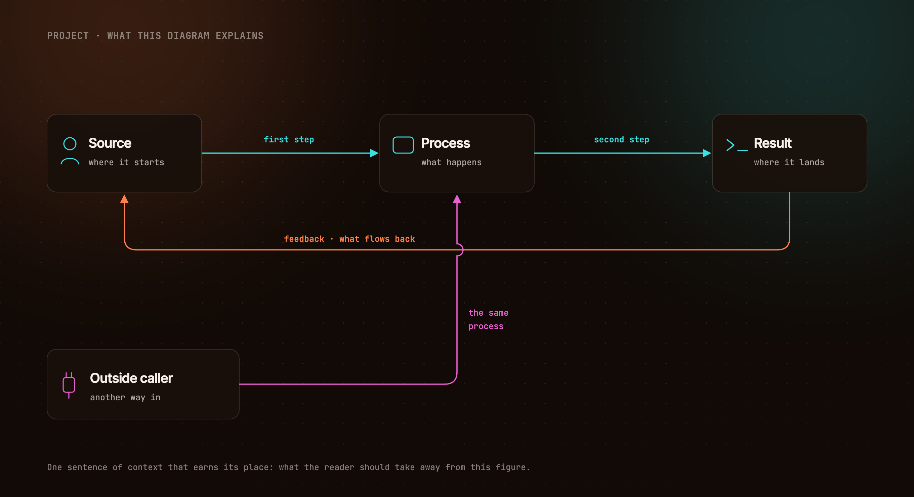
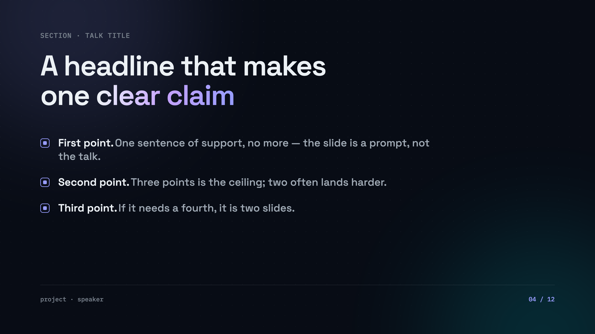
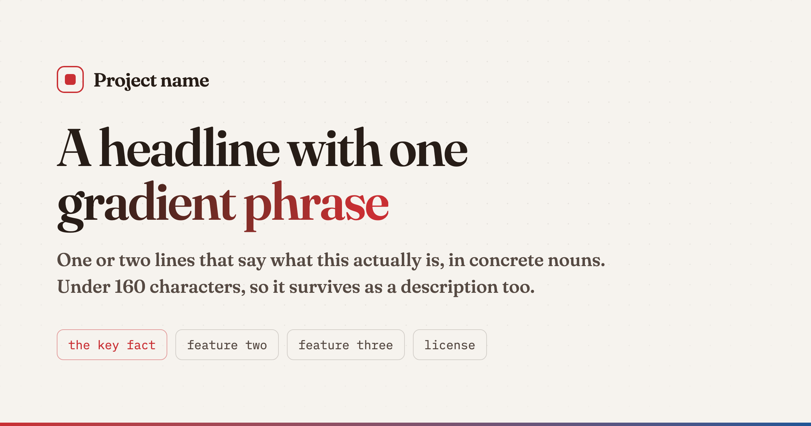
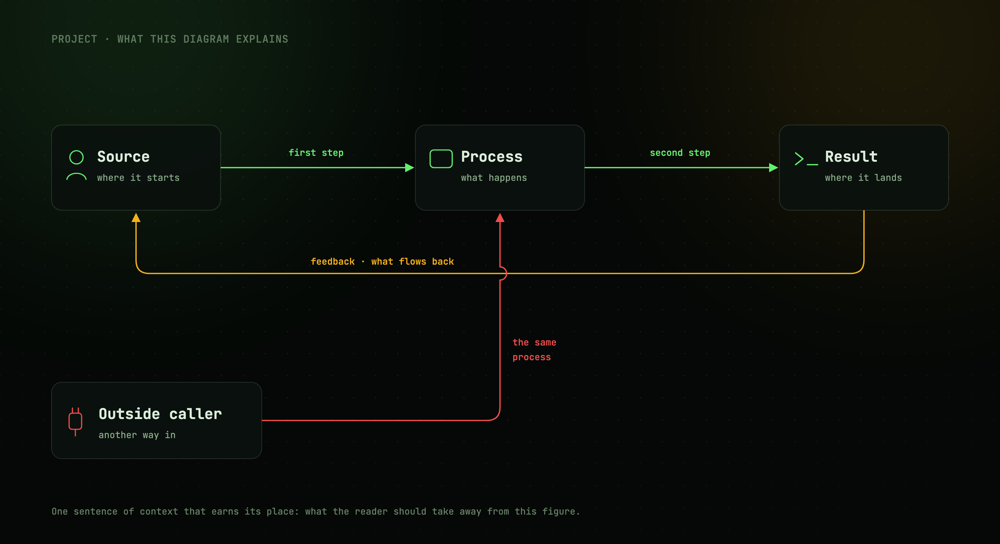
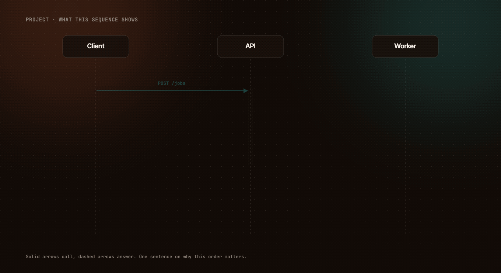
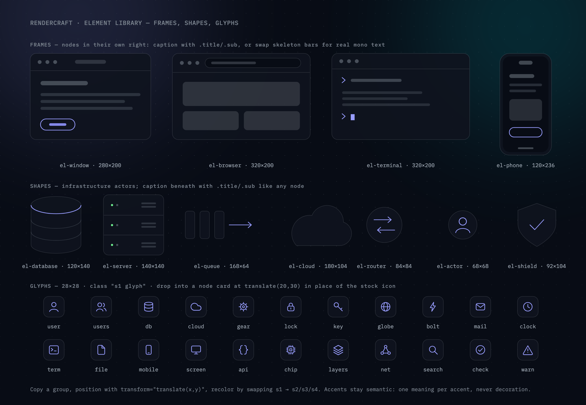

# rendercraft

A [Claude Code](https://claude.com/claude-code) skill that turns Claude into a competent
visual designer for **diagrams, presentation slides, and social cards** — authored as
HTML/SVG, rendered to crisp PNGs by the headless Chromium you already have. No design tool,
no API, no dependencies.

| | | |
| --- | --- | --- |
|  |  |  |
| diagram · `ember` | slide · `slate` | card · `paper` |

Same markup, different theme:



And sequence diagrams animate — each step tweened over several frames (`slide`, `fade`, or
`pop` presets), assembled into a looping GIF **in pure Node** (Chrome renders the frames in
parallel, the built-in zlib decodes them, a hand-rolled GIF89a/LZW encoder with
changed-region deltas does the rest; no ffmpeg, still zero dependencies):



Figures assemble from a copy-paste **element library** — window/browser/terminal/phone
frames, database, server, queue, cloud, router, actor, shield, and a 22-glyph icon set —
every part built from theme tokens, so it restyles with the theme like everything else:



## Why HTML instead of a design tool

- **Versioned and diffable** — a figure is a text file; regenerating after a copy change is one command
- **Consistent by construction** — templates consume theme tokens, so nothing is hand-picked per image
- **Agent-friendly** — Claude writes HTML far better than it steers a canvas

## Install

Requires Node 18+ and any Chromium browser (Chrome, Chromium, Brave, Edge).

**For yourself (all projects):**

```sh
git clone https://github.com/imshaikot/rendercraft.git ~/.claude/skills/rendercraft
```

**For one project (shared with your team):**

```sh
git clone https://github.com/imshaikot/rendercraft.git .claude/skills/rendercraft
```

Then just ask Claude Code for a visual: *"make a diagram of our auth flow"*,
*"turn these notes into a 6-slide deck, paper theme"*, *"an og card for this repo"*.

## Use it by hand

```sh
node scripts/render.mjs templates/diagram.html figure.png --theme slate
node scripts/animate.mjs templates/sequence.html sequence.gif --theme ember
```

The size comes from the template's `<body>`; `--scale` defaults to 2 (retina).
`CHROME_PATH` overrides browser discovery.

## What's inside

```
SKILL.md            the skill: workflow, aesthetic rules, layout discipline
templates/          diagram (1360×740) · slide (1920×1080) · card (1200×630) · sequence (animatable) · elements (parts sheet)
themes/             ember · slate · paper · terminal  (design tokens, swappable)
scripts/            render.mjs (PNG) · animate.mjs (GIF) · gif.mjs (pure-Node GIF89a encoder)
```

Adding a theme is one CSS file defining the same tokens. Adding a template is one HTML file
that consumes only tokens.

## License

[MIT](LICENSE)
